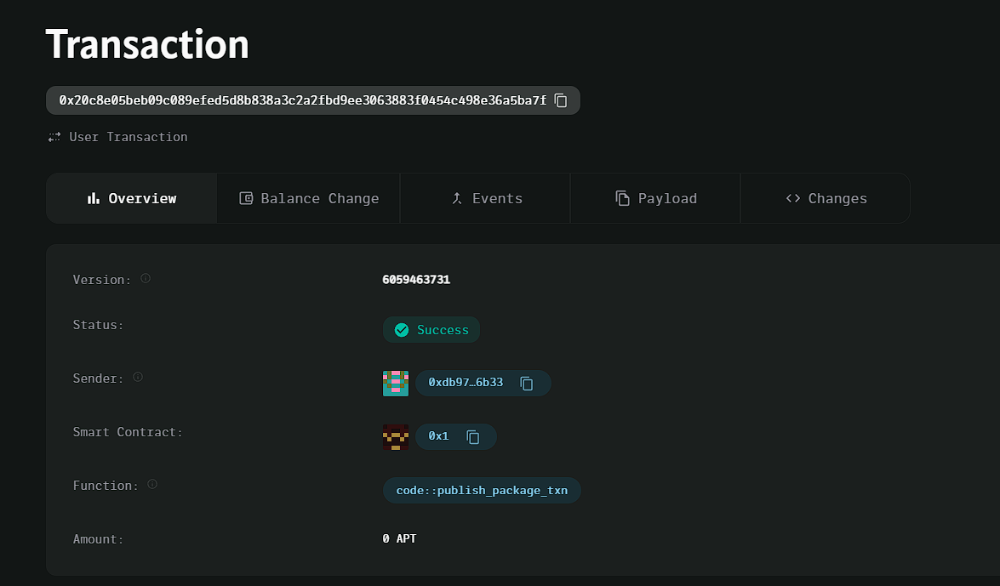

### Deployed smartcontract address: 0x20c8e05beb09c089efed5d8b838a3c2a2fbd9ee3063883f0454c498e36a5ba7f

### Screenshot:

# Energy Usage Tracker

## Project Title
Energy Usage Tracker

## Project Description
The Energy Usage Tracker is a decentralized system designed to track and record a user's energy consumption. This system stores energy consumption data securely on the blockchain, ensuring transparency, immutability, and easy access to users' energy usage history.

## Vision
To provide a transparent, decentralized solution for tracking energy consumption, empowering users to monitor their energy usage and encouraging sustainable energy practices. This system promotes accountability and data integrity, ensuring that consumption data is reliable and secure.

## Key Features
- **Decentralized Energy Tracking:** Stores user energy consumption data on the blockchain for transparency and trust.
- **Secure and Immutable:** Data is tamper-proof, providing an accurate record of energy consumption.
- **User-Centric:** Each user can view and track their own energy usage directly.
- **Simple and Efficient:** The system only stores and retrieves essential energy data, making it lightweight and easy to integrate.

## Future Scope
- **Energy Efficiency Insights:** Add features to analyze and provide recommendations on energy-saving practices based on users' historical data.
- **Multi-User Support:** Enable tracking energy consumption across multiple users for household or corporate energy usage.
- **Integration with IoT Devices:** Allow integration with smart meters or IoT devices for real-time energy tracking.
- **Incentive Programs:** Implement reward mechanisms for users who adopt sustainable energy usage patterns.
- **Custom Reporting:** Provide users with detailed energy usage reports that can be shared with energy providers or authorities.

